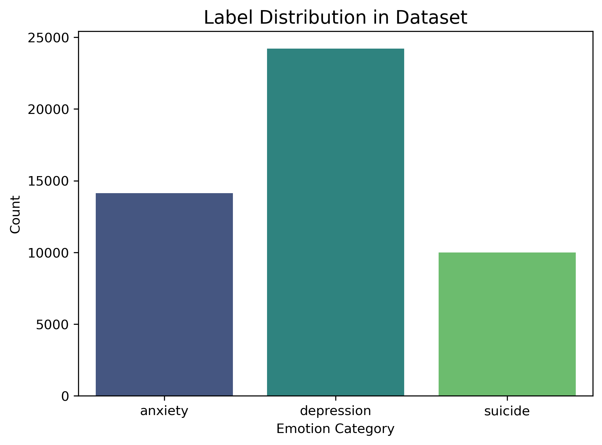
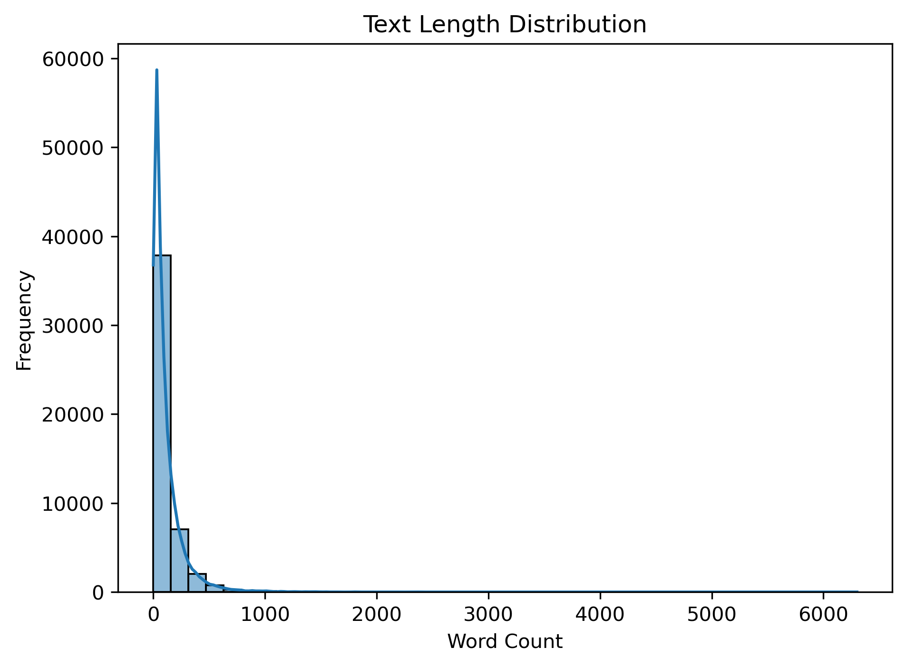
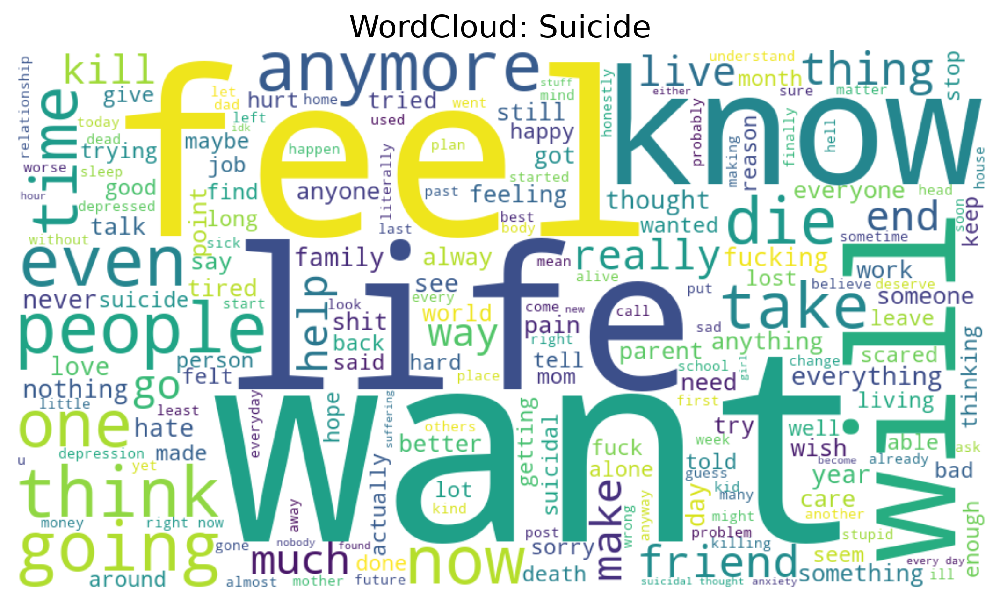
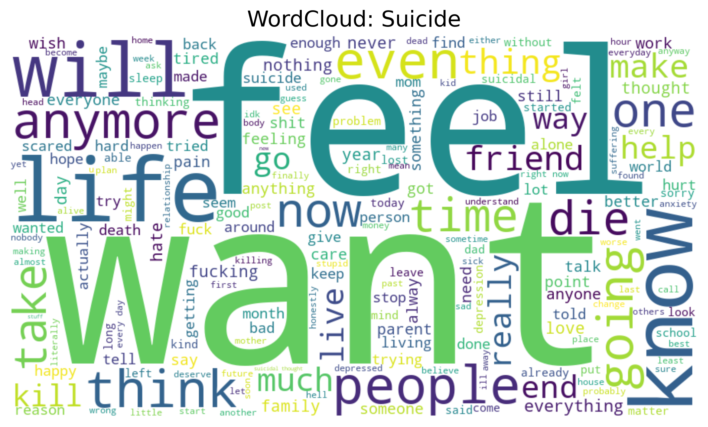
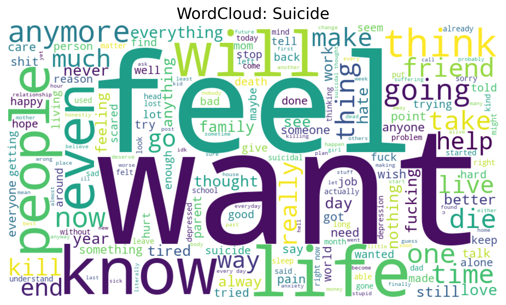
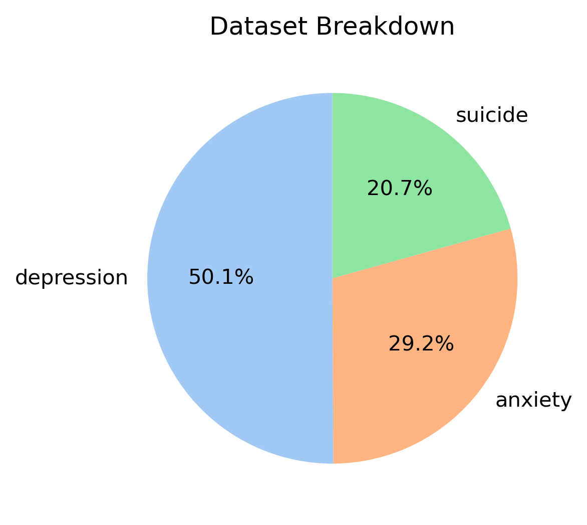
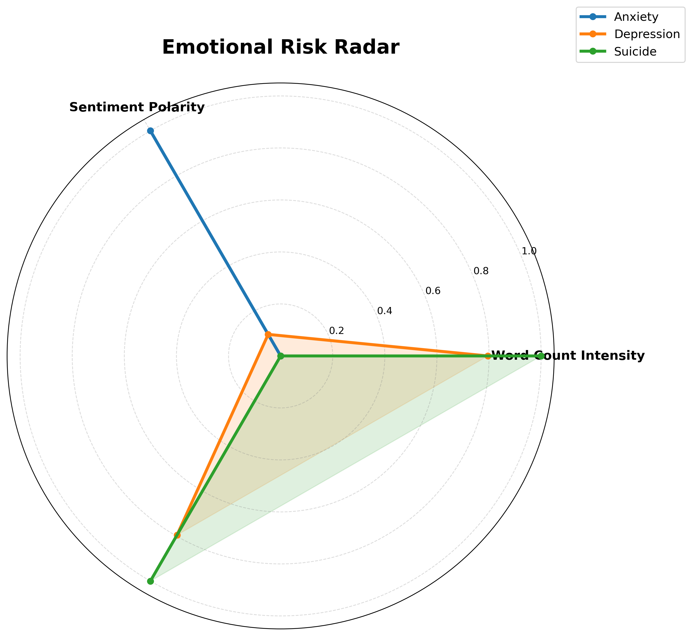

##Mental-Health-ML-&-NLP-Analysis

-A project where mental health text data is analyzed and ML model is trained, which classifies text into three main emotions/Labels : 'Depression','Suicide'and 'Anxiety'.
-Along with it, visualizations and insights like label distribution, word clouds, F1 scores, and emotional risk radar are shown.

##Features

-Text Cleaning & Preprocessing (Punctuation removal, Lowercase, Stopwords, URLs removal)
-Label Mapping & Standarization
-TF-IDF vectorization for ML
-Logistic Regression model for emotion classification
-Evaluation metrics: Accuracy, Classification Report, Confusion Matrix, F1 scores
-Visualization:
         -Label Distribution
         -Text Lenth Histogram
         -WordClouds
         -Confusion Matrix
         -F1 Score Barplot
         -Dataset Breakdown Pie Chart
         -Emotional Risk Radar

##Visualizations/ Insights

-Label Distribution: Counts Every Emotion count in dataset

-Text Lenth Distribution: Word Count histogram of text

-WordClouds: Highlights important and most used words in label

-Confusion Matrix: Prediction analyiss of model

-F1 Score per Emotion: Performance metrics of model

-Dataset breakdown pie chart: Class Proportion

-Emotional Risk Radar: Radar chart comparing word count intensity and sentiment polarity per label

##Model Performance:

-Accuracy: 0.78
-Classification Report: Includes precision, recall, F1-Scorecper emotion

All the evaluation metrics and visualizations are shown in notebook in detail.

##Tech Stack
-Python (pandas, numpy, re, string)
-scikit-learn (Logistic Regresion, TF-IDF, metrics)
-matplotlib, seaborn, wordcloud
-Jupyter Notebook

##Future Imporovements
-Dataset expanding with more emotions
-Model improvements with advanced NLP technique

         
